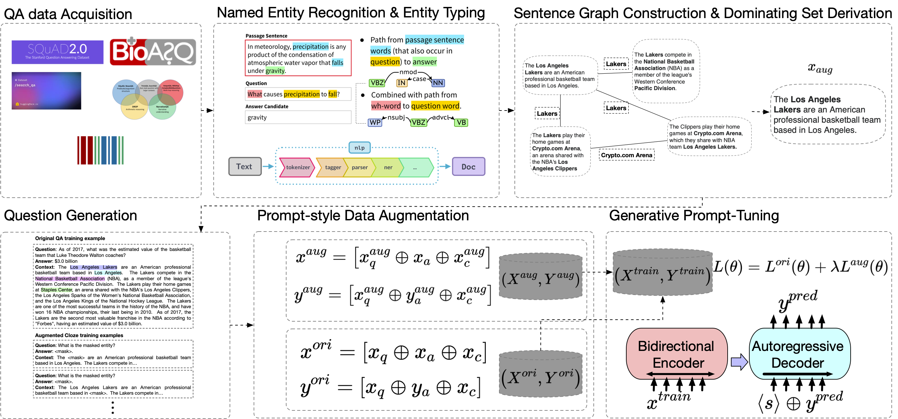

# MinPrompt: Graph-based Minimal Prompt Data Augmentation for Few-shot Question Answering
MinPrompt: Graph-based Minimal Prompt Data Augmentation for Few-shot Question Answering

This repository contains the source code and datasets for [MinPrompt: Graph-based Minimal Prompt Data Augmentation for Few-shot Question Answering](https://arxiv.org/pdf/2310.05007).

## Links

- [Requirements](#requirements)
- [Overview](#overview)
- [Sentence Graph Construction](#sentence-graph-construction)
- [Dominating Set Derivation](#dominating-set-derivation)
- [Question Generation from Dominating Set](#question-generation-from-dominating-set)
- [Fine-tune](#fine-tune)
- [Citations](#citations)

## Requirements

The code is written in Python 3.8. Before running, you need to first install the required packages by typing following commands (Using a virtual environment is recommended):

```
pip3 install -r requirements.txt
```

## Overview
**MinPrompt** is a minimal data augmentation framework for open-domain QA based on an approximate graph algorithm and unsupervised question generation. We transform the raw text into a graph structure to build connections between different factual sentences, then apply graph algorithms to identify the minimal set of sentences needed to cover the most information in the raw text. We then generate QA pairs based on the identified sentence subset and train the model on the selected sentences to obtain the final model.
Empirical results on several benchmark datasets and theoretical analysis show that **MinPrompt** is able to achieve comparable or better results than baselines with a high degree of efficiency, bringing consistent improvements in F-1 scores. 

<p align="center">
  
</p>

## Sentence Graph Construction
```
python question_gen/distant_supervision/sentence_graph_adjlist_gen.py
```

## Dominating Set Derivation

```
python graph_dominating_set/src/sentence_graph_dominating_set.py
```

## Question Generation from Dominating Set
```
python question_gen/distant_supervision/question_generation_from_dominating_set.py
```

## Fine-tune
```
python finetune/src/gotta/run.py
```

## Citations

Please cite the following paper if you find this repo helpful for your research.
```
@article{chen2023minprompt,
  title={MinPrompt: Graph-based Minimal Prompt Data Augmentation for Few-shot Question Answering},
  author={Chen, Xiusi and Jiang, Jyun-Yu and Chang, Wei-Cheng and Hsieh, Cho-Jui and Yu, Hsiang-Fu and Wang, Wei},
  journal={arXiv preprint arXiv:2310.05007},
  year={2023}
}
```
